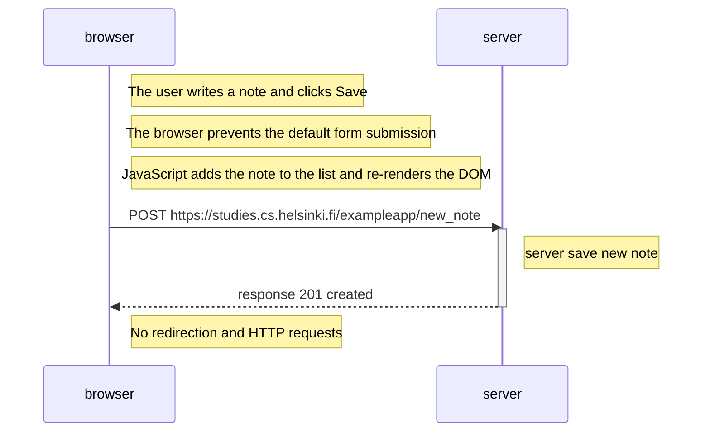

```mermaid
sequenceDiagram
participant browser
participant server

    Note right of browser: The user writes a note and clicks Save
    Note right of browser: The browser prevents the default form submission
    Note right of browser: JavaScript adds the note to the list and re-renders the DOM
    browser ->>server: POST https://studies.cs.helsinki.fi/exampleapp/new_note
    activate server
    Note right of server: server save new note

    server-->> browser: response 201 created
  deactivate server
    Note right of browser:No redirection and HTTP requests
    
```
